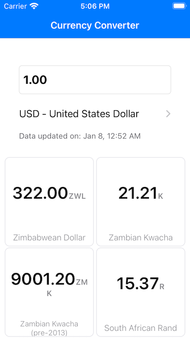
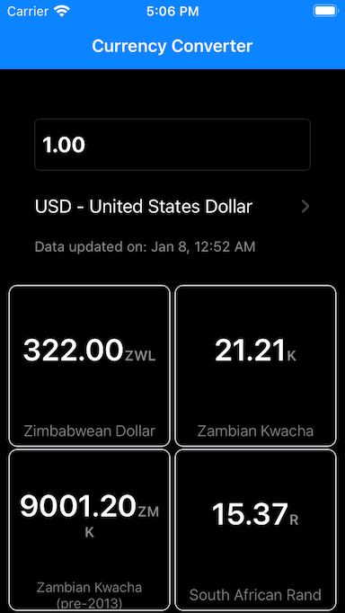

# Currency Converter Test 💵

 

## General approach and considerations
* 100% Swift, with no external dependencies.
* Using default Apple UI components.
* Dark mode ready.
* Protocol oriented programming FTW, composition over inheritance.
* Localized project.

## Patterns
* Define some `Router`s to specify a reachable data resource.
* Using Apple's `Combine` to create publishers and handle the data downloading and decoding, from the specified routers.
* Define some `Store`s to retrieve data using the specific publishers.
* Using an `Interactor` approach, to transform and organize data, according to the scene requirements.
* Using `ViewModel`s to comunicate data processed and organized from the interactors, to the view controller.
* `MVVM` in general for data logic handling and communication between `UIViewController` events and actions, using a simple `Bindable` protocol.
* I didn't handle any specific layer for rendering, just created a simple `Rendereable` and `Renderizer` protocol to simplify the rendering update.
* I used a simple dependency injection pattern by properties, for the data passing between the main and detail scenes.
* I'd improve a better approach for this ☝🏼, like flow coordinators with a more complex dependency injection implementation, but I think the scope of the project the approach used is OK.

## Model Layer
* I used `Struct`s to handle immutable data.
* Using nested definitions for namespace correctness.
* Added a `Storage` layer to handle simple data persistance in app bundle's documents folder.

## Logic Layer
* Client logic (currency conversion) is handled in its own `Converter` entity.

## View Layer
* Everything related to data is handled in the actual elements for this purpose: views, cells, or the 
delegates or events of the visual components inside the view controllers.
* I decided to keep the `UIStoryboards` approach, with not so much change on this part from the default project configuration.
* Some views that are reused have its own custom subclass.
* All working with auto layout, even the ones adjusted in execution time.

## Unit Tests
* Unit tests added for the data layer, considering: encoding, decoding and storage.
* There are also unit tests for the currency conversions.

## Current Pitfalls
**Note:** There are several pitfalls in the implementation, here I can list some:
* Missing launch image.
* UI tests.
* More extensive UI testing.

Maybe I am missing something else, but this is what I could do with the available time I had.

Thank you for the opportunity.

ありがとうございます! 🙇🏽‍♂️

## About

Author: [**Victor Soto**][vs]

Last Revision: 08-01-21

[vs]: https://www.victorso.to
